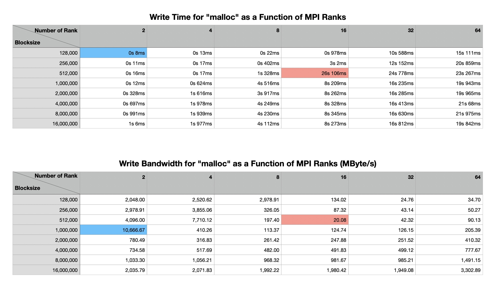
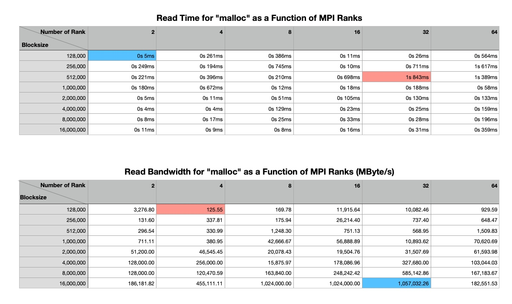
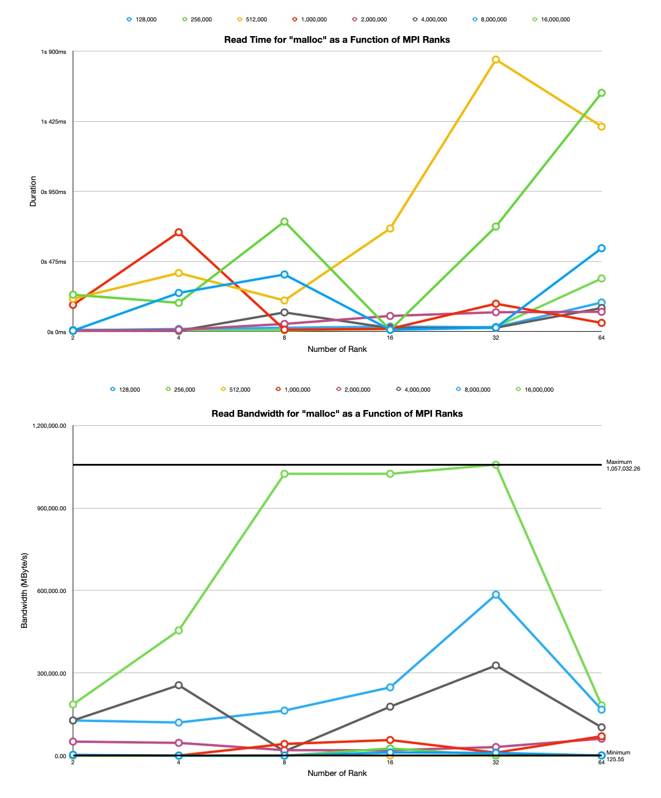
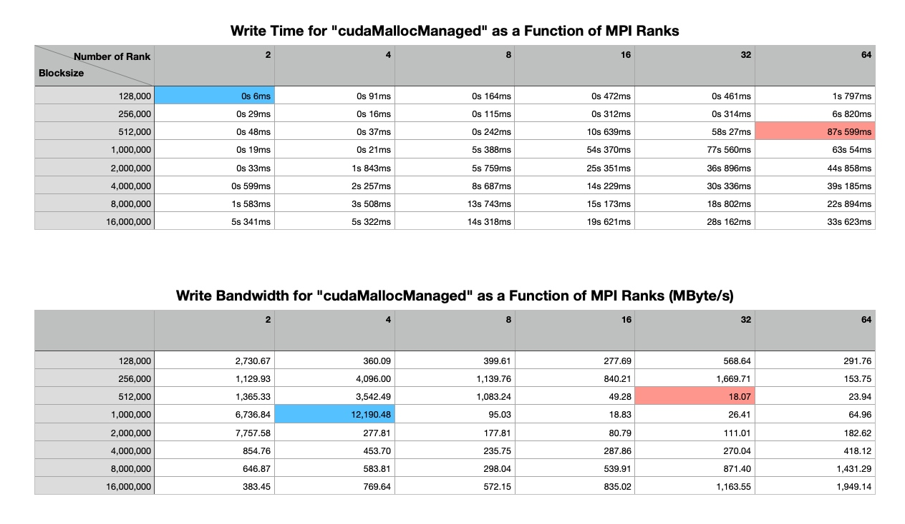
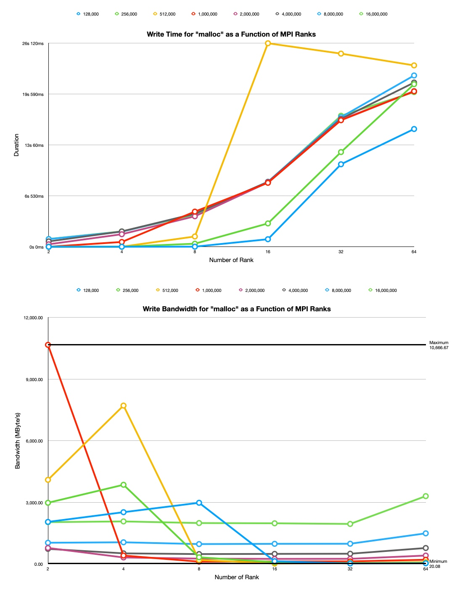
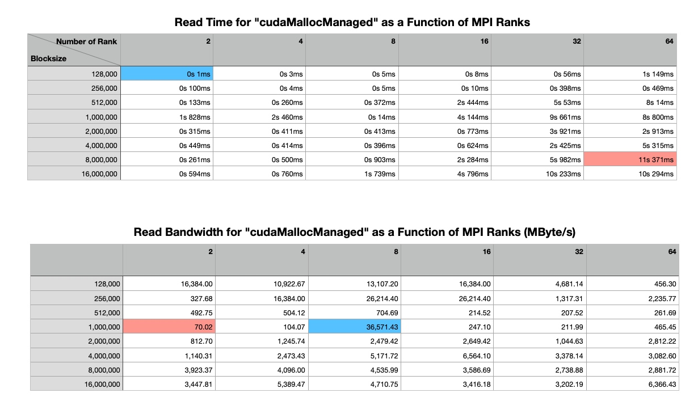
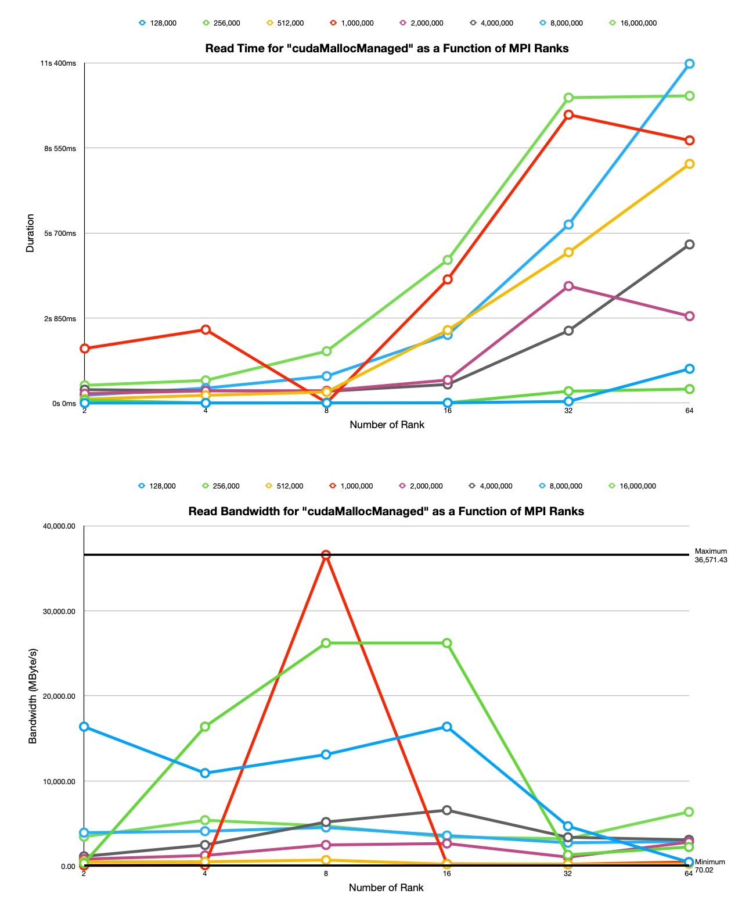

# MPI I/O Analysis
## Statistic Summary 
### 1. For `malloc` as a function of MPI ranks
- Write
    - From the graph, we see that as the MPI ranks increase, the bandwidth used for writes decreased. This is especially evident when writing block size of 1M bytes. When performing this task, bandwidth usage went from approximately 10,666 Megabytes/s with 2 MPI ranks to approximately 410 Megabytes/s when 4 MPI ranks were used. This trend was also evident with block size 512K bytes, where bandwidth usage decreased from approximately 7710 Megabytes/s at 4 MPI ranks to 197 Megabytes/s with 8 MPI ranks. Block size 2M bytes also showed a decrease in bandwidth usage from 780 Megabytes/s with 2 MPI ranks to 316 Megabytes/s with 4 MPI ranks. Another steep drop occurred when writing block size 128K bytes. Bandwidth usage dropped from 2978 Megabytes/s using 8 MPI ranks to 134 Megabytes/s with 16 MPI ranks. 



- Read
    - The Bandwidth usage for reads were consistently much lower than that of writes.  However, it is interesting to note that bandwidth usage for reads across the different number of ranks increased as the block size (file size) increased.  




### 2. For `cudaMallocManaged` as a function of MPI ranks
- Write Time
    - The amount of bandwidth used during writes also showed a general decreasing trend with increasing MPI ranks. This was most evident with block size 1M bytes. Here, bandwidth usage decreased from approximately 12000 Megabytes/s using 4 MPI ranks to 95 Megabytes/s using 8 MPI ranks. Bandwidth usage further declined to approximately 18 Megabytes when 16 MPI ranks were used to write the data. Writing block size 2M bytes also showed this decrease. The bandwidth usage decreased from 7757 Megabytes/s using 2 MPI ranks to 277 Megabytes/s when writing with 8 MPI ranks. Using 16 MPI further reduced the bandwidth usage to approximately 81 Megabytes/s. Decreasing trends were also evident when writing 512K bytes, 256k bytes, and 128K bytes.  




- Read Time
    - With `cudaMallocManaged`, bandwidth usage for reads was also lower than writes. Apart from when reading block sizes 1M bytes, 256M bytes, and 128K bytes, bandwidth usage for reads using `cudaMallocManaged` across the other block sizes were consistent.   




## Conclusion
- **What trends do you see in this data?** 
    - For `malloc` as a function of MPI ranks:
        - From the graph, we see that as the MPI ranks increase, the bandwidth used for writes decreased.
    - For `cudaMallocManaged` as a function of MPI ranks 
        - The amount of bandwidth used during writes also showed a general decreasing trend with increasing MPI ranks.
- **Does it matter whether or not the memory is allocated by CUDA or regular system memory?**
    - Yes.
    - When the memory is allocated by CUDA instead of regular system memory, the runtime is much longer. 
    - Overall, more bandwidth was used for writes for larger block sizes (2M bytes to 16M bytes) when using `malloc` as opposed to `cudaMallocManaged`. This suggests that writing large files using memory assigned by `cudaMallocManaged` was faster or more efficient. There was not much difference between the `malloc` and `cudaMallocManaged` for the smaller block (file) sizes. 
    - In terms of reads, the most interesting observation is that reading larger files (2M bytes - 16M bytes) allocated with `cudaMallocManaged` required significantly less bandwidth than reading larger files allocated with Malloc. On the contrary, reading smaller files (128K bytes - 1M bytes) allocated with Malloc used less bandwidth in majority of the cases than reading those files allocated with `cudaMallocManaged`. 
- **Do read and writes bandwidth differ? If so, why and by how much.**
    - In general, the bandwidth usage for reads were consistently much lower than that of writes.
    - **Reason:** We suppose the reason might be that reading is not computation or bandwidth intensive in most applications. However, in performing writes, the system actually puts data onto the physical disks (or in memory). This requires much more computation and resources, including bandwidth, than reading what values are stored.
- **What performance trend is observed as block size is increased for reads and for writes?**
    - For writes:
        - In general, the performance (bandwidth) decreases first then increases as the block size increases.
    - For reads:
        - In general, the performance (bandwidth) increases first then decreases as the block size increases.


## Reference
- Testing Shell scripts
    - `auto-test.sh` 

        ```Bash
        #!/bin/bash
        
        rm ./slurm-* ./*_blksz
        
        for i in 2 4 8 16 32
        do
            sbatch -N 1 --ntasks-per-node="$i" --gres=gpu:1 -t 30 ./slurmSpectrum.sh
            sleep 30s
            rm ./*_blksz
        done
        
        sbatch -N 2 --ntasks-per-node=32 --gres=gpu:1 -t 30 ./slurmSpectrum.sh
        sleep 30s
        rm ./*_blksz
        ```
        
    - `auto-print.sh`
    
        ```Bash
        #!/bin/bash
        
        for i in slurm-*
        do
            echo "--------------------------------------"
            echo "$i:"
            echo ""
            tail -n 15 "$i"
            echo ""
        done
        ```

